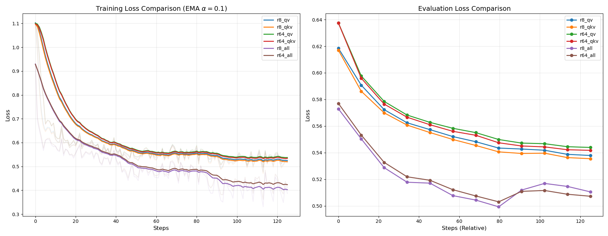

# Llama-3.1-8B LoRA Fine-Tuning on GSM8K


This project investigates how different **LoRA fine-tuning configurations** affect the mathematical reasoning performance of **Llama-3.1-8B** on the **GSM8K** dataset.

The experiment compares LoRA ranks, target modules, training behavior, validation loss, and final inference accuracy.  
The main goal is to analyze not only the final score, but also **parameter efficiency**, **training stability**, and the different roles of **attention modules** and **MLP modules** in mathematical reasoning.

> Full project report: [LoRA - Finetuning Project PDF](document/LoRA%20-%20Finetuning%20프로젝트.pdf)

---

## Project Overview

Full fine-tuning of large language models is expensive and difficult under limited GPU resources.  
To make fine-tuning more practical, this project uses **LoRA**, which freezes the original model weights and trains only small low-rank adapter matrices.

The experiment focuses on the following questions:

1. Does a higher LoRA rank always improve performance?
2. Is fine-tuning only Query and Value projections enough for GSM8K?
3. What happens when Key projection is added?
4. Are MLP layers more important than attention layers for mathematical reasoning?
5. Which LoRA configuration gives the best trade-off between accuracy and parameter efficiency?

---

## Experimental Setup

| Category | Setting |
|---|---|
| Base Model | `meta-llama/Llama-3.1-8B` |
| Dataset | GSM8K |
| Task | Grade-school mathematical reasoning |
| Fine-tuning Method | LoRA |
| GPU | NVIDIA V100 32GB |
| Precision | FP16 |
| Framework | HuggingFace Transformers, PEFT, TRL |
| Epochs | 3 |
| Evaluation Method | Numeric answer matching |

---

## LoRA Configurations

Two LoRA rank values were tested:

```text
r = 8
r = 64
```

Four target module groups were compared:

| Configuration | Target Modules |
|---|---|
| `qv` | `q_proj`, `v_proj` |
| `qkv` | `q_proj`, `k_proj`, `v_proj` |
| `all` | Attention + MLP-related modules |
| `mlp` | MLP-related modules only |

The final experiment matrix was:

```text
r8_qv
r8_qkv
r8_all
r8_mlp
r64_qv
r64_qkv
r64_all
r64_mlp
```

---

## Learning Rate Settings

| Rank | Learning Rate |
|---|---|
| `r = 8` | `1e-4` |
| `r = 64` | `2e-5` |

A smaller learning rate was used for `r = 64` because the number of trainable parameters increases significantly.  
When too many parameters are trained with a high learning rate, training can become unstable.

---

## Dataset Split

The GSM8K training set was split into training and validation sets.

```text
train : validation = 9 : 1
seed = 42
```

The validation set was used to select the best adapter checkpoint during training.

---

## Repository Structure

```text
.
├── README.md
├── document/
│   └── LoRA - Finetuning 프로젝트.pdf
├── image/
│   ├── Title.png
│   └── graph.png
├── final_logs/
│   ├── r8_qv/
│   ├── r8_qkv/
│   ├── r8_all/
│   ├── r8_mlp/
│   ├── r64_qv/
│   ├── r64_qkv/
│   ├── r64_all/
│   └── r64_mlp/
├── inference_logs/
└── inference_mini_log/
```

---

## Implementation Notes

During the project, the initial implementation had two major issues.

### 1. GPU Memory Issue

In the first version, training and inference were handled in a single script.  
During baseline evaluation, the base Llama model was loaded again, which caused GPU memory pressure.

As a result, the model attempted CPU offloading, and the process remained alive without meaningful GPU computation.

To solve this issue, the code was separated into:

```text
train.py
inference.py
run.sh
```

This made training and inference independent and reduced memory-related failures.

---

### 2. Incorrect Causal LM Preprocessing

The first preprocessing implementation tokenized the question and answer separately:

```python
model_inputs = tokenizer(inputs, ...)
labels = tokenizer(targets, ...)
model_inputs["labels"] = labels["input_ids"]
```

This was problematic because causal language models should learn from a single continuous sequence.  
The `input_ids` and `labels` were misaligned, so the model did not learn properly.

The corrected version used an instruction-style format and masked only the prompt part.  
Loss was calculated only on the assistant response.

```python
response_template = "<|start_header_id|>assistant<|end_header_id|>\n\n"

data_collator = DataCollatorForCompletionOnlyLM(
    response_template=response_template,
    tokenizer=tokenizer
)
```

This correction significantly improved training behavior.

---

## Training and Evaluation Loss



The graph compares training loss and evaluation loss across LoRA configurations.

### Key Observations

- All configurations showed decreasing training loss.
- `all` configurations reached low evaluation loss faster than attention-only configurations.
- However, `r8_all` and `r64_all` showed a slight increase in evaluation loss near the end of training.
- This suggests early signs of overfitting when too many modules are fine-tuned.

A notable result appeared in the `qkv` setting:

```text
r64_qkv validation loss > r8_qkv validation loss
```

Although `r = 64` has more trainable parameters, it did not always produce better validation loss.  
This suggests that increasing rank blindly can reduce parameter efficiency, especially when LoRA is applied only to a limited set of attention modules.

---

## Main Evaluation Results

| Target Modules | `r = 8` Accuracy | `r = 64` Accuracy |
|---|---:|---:|
| Q, V | 56.67% | 55.00% |
| Q, K, V | 61.67% | 52.67% |
| All | 61.67% | **64.00%** |
| MLP | 61.67% | 62.33% |

Baseline accuracy:

```text
Baseline Accuracy = 5.33%
```

All LoRA fine-tuned models significantly outperformed the baseline.

---

## Result Analysis

### Effect of LoRA Rank

A larger LoRA rank did not always improve performance.

For example:

```text
r8_qkv  = 61.67%
r64_qkv = 52.67%
```

Although `r = 64` increases model capacity, it performed worse than `r = 8` in the `qkv` setting.  
This suggests that adding too many trainable parameters to a limited module group can lead to inefficient learning.

However, when LoRA was applied more broadly, `r = 64` became more effective:

```text
r64_all = 64.00%
r64_mlp = 62.33%
```

This indicates that a larger rank is more useful when the trainable capacity is distributed across appropriate modules.

---

### Attention Modules vs MLP Modules

Attention-only configurations were not the strongest settings.

The MLP-only configuration performed better than several attention-based settings:

```text
r64_qv  = 55.00%
r64_qkv = 52.67%
r64_mlp = 62.33%
```

This suggests that MLP layers are highly important for GSM8K.  
Mathematical reasoning requires not only contextual understanding but also internal computation and logical transformation, which are strongly related to feed-forward layers in transformer blocks.

---

### Best Configuration

The best result was achieved by:

```text
r64_all
Accuracy = 64.00%
```

This configuration fine-tunes both attention and MLP-related modules.

It likely performs best because:

- attention modules help track context,
- MLP modules help with reasoning and arithmetic computation,
- broader module coverage allows LoRA parameters to be distributed more effectively.

However, this setting is less parameter-efficient and showed possible overfitting signs in the validation loss curve.

---

## Qualitative Error Analysis

The generated answers were analyzed using saved correct and wrong samples.

### Successful Cases

The fine-tuned models successfully handled several reasoning patterns.

#### Semantic-to-Numeric Conversion

The model correctly interpreted expressions such as:

```text
one-third    → division by 3
twice as many → multiplication by 2
one fewer    → subtraction by 1
```

#### Multi-Step Arithmetic

The model was able to solve problems involving multiple arithmetic steps, such as:

```text
volume = width × length × height
total cost = number of bags × price per bag
```

#### Unit-Based Calculation

Some examples required understanding quantities such as cubic feet, bags, and dollars.  
The fine-tuned model was able to follow these unit transitions correctly in several cases.

---

### Failure Cases

Despite the accuracy improvement, several failure patterns remained.

#### Repetition After the Correct Answer

Some outputs produced the correct answer first, but then continued generating repeated text.

Example pattern:

```text
#### 120
Together, Lily and Amy have 120 friends.
#### 120
...
```

This suggests that decoding constraints or stopping criteria should be improved.

#### Corrupted Text Generation

Some outputs contained broken or noisy characters after the answer.

Example pattern:

```text
#### 24�ERMERMERCHANTABILITY
```

This may be related to generation settings, tokenizer behavior, or insufficient stopping control.

#### Confusion with Distracting Conditions

The model struggled when the problem included many entities or conversion rules, such as stickers, buttons, and multiple exchange rates.

#### Time Reasoning Failure

The model performed poorly on problems involving time intervals across AM/PM boundaries.

#### Self-Created Conditions

In some wrong answers, the model introduced conditions that were not present in the original problem.

Example pattern:

```text
4 hours every week → incorrectly transformed into 4 * 7
```

This indicates that the model sometimes hallucinates intermediate assumptions during multi-step reasoning.

---

## Limitations

This project has several limitations.

1. **Limited rank search**
   - Only `r = 8` and `r = 64` were tested.
   - Intermediate values such as `r = 16` or `r = 32` may give better trade-offs.

2. **Unequal trainable parameter counts**
   - Different target module settings have different numbers of trainable parameters.
   - Therefore, the comparison is not perfectly controlled.

3. **Limited hardware**
   - The experiment was conducted on a V100 32GB GPU.
   - This constrained batch size, sequence length, and experiment scale.

4. **Simple answer extraction**
   - Accuracy was based on extracted numeric answers.
   - More robust evaluation could improve result reliability.

5. **Generation quality issues**
   - Some models produced repeated or corrupted outputs.
   - Better decoding settings are needed.

---

## Conclusion

This project shows that LoRA fine-tuning can significantly improve Llama-3.1-8B performance on GSM8K under limited GPU resources.

The best accuracy was achieved by:

```text
r = 64
target_modules = all
Accuracy = 64.00%
```

However, this does not mean that a larger rank is always better.  
The `r64_qkv` result showed that increasing rank without considering target module coverage can reduce efficiency and even hurt performance.

The most important finding is that **MLP fine-tuning was highly effective for mathematical reasoning**.  
For GSM8K, applying LoRA to MLP modules was more useful than applying LoRA only to attention projections.

Overall, the results suggest that a better future configuration would be:

```text
rank = 16 or 32
target_modules = all or MLP-focused
with careful early stopping
```

---

## Future Work

Future improvements include:

- testing intermediate ranks such as `r = 16` and `r = 32`,
- comparing models with similar trainable parameter counts,
- using early stopping to reduce overfitting,
- improving generation stopping criteria,
- applying stricter answer extraction,
- evaluating with more robust metrics,
- comparing LoRA with QLoRA under the same hardware constraints.

---

## Acknowledgements

This project was conducted as part of a Llama fine-tuning experiment on GSM8K.
